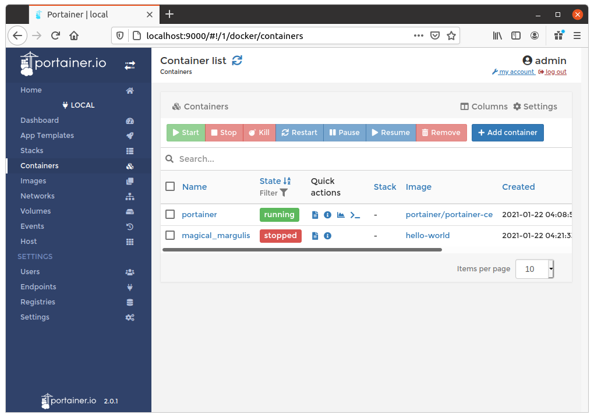
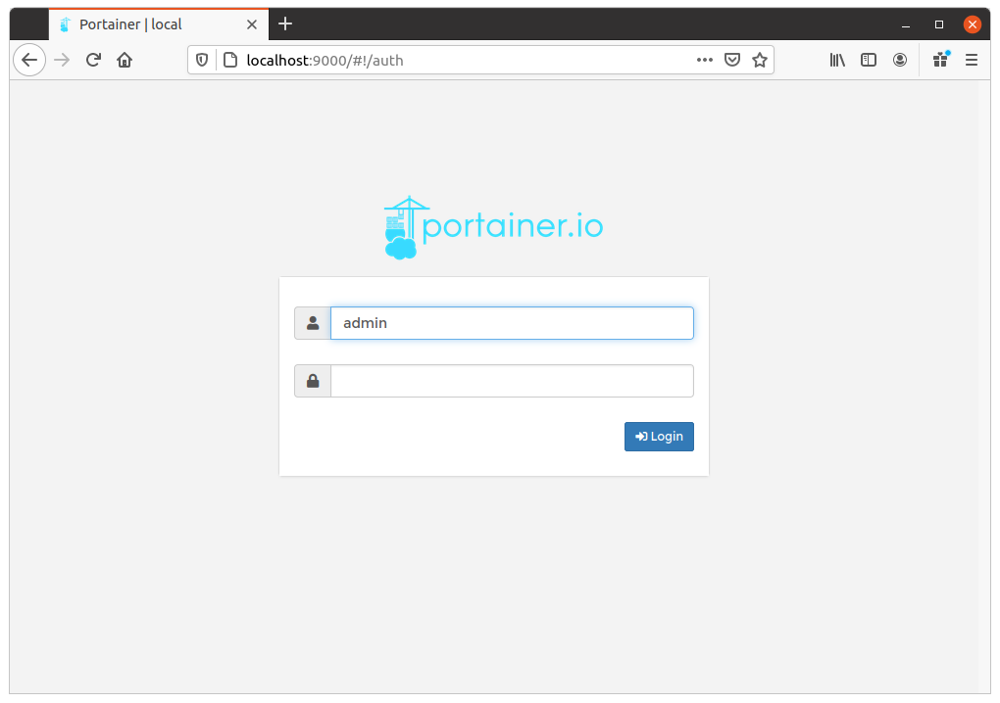

# Docker notes

## Commands

#### List images

```bash
# List all images
docker images

# List images IDs
docker images -q
```

#### Delete images

```bash
# Delete image by ID
docker rmi <image-id>

# Delete all images
docker rmi $(docker images -q)
```

#### Build an image

```bash
# Build from a Dockerfile in the current directory and tag the image
docker build -t myimage:1.0 .
```

#### List containers

```bash
# List running containers
docker container ls

# List all containers
docker container ls -a

# List all container IDs
docker container ls -a -q 
```

`container ls` has the alias: `ps`. So the previous commands can be also executed like:


```bash
# List running containers
docker ps

# List all containers
docker ps -a

# List all container IDs
docker ps -a -q 
```

## Portainer - A Docker GUI

#### Introduction

Portainer is an open source container management tool for Kubernetes, Docker, Docker Swarm and Azure ACI (see [link](https://documentation.portainer.io/)). It allows containers deployment and management without the need to write code.




#### Running as a container

Portainer is run as Docker container. From the command line:

```
docker run -d -p 8000:8000 -p 9000:9000 --name=portainer --restart=always -v /var/run/docker.sock:/var/run/docker.sock -v portainer_data:/data portainer/portainer-ce
```

The application can be started and stopped like:

```bash
# Start
docker container start portainer

# Stop
docker container stop portainer
```

!!! tip
    We recommend to create a named container first (see `--name=portainer` option in the `docker run` above in the commands above) only once.
    
    Once created, simply use the `start` and `stop` actions.

#### admin password

The very first time you execute Portainer you will be asked to set a password for the `admin` user. After that you will have to login:



Portainer also includes a tool (see [link](https://github.com/portainer/helper-reset-password)) to reset `admin` password:

```bash
# Stop the existing Portainer container
docker container stop portainer

# Run the helper using the same bind-mount/volume for the data volume
docker run --rm -v portainer_data:/data portainer/helper-reset-password

# Start portainer and use the password above to login
docker container start portainer
```

The `helper-reset-password` tool will output the new `admin` password.


## Glossary


