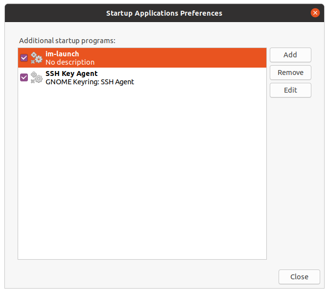

# Linux notes

## Common steps after installation

```bash
# Upgrade
sudo apt-get update
sudo apt-get upgrade -y
sudo apt-get autoremove -y

# Common packages
sudo apt-get install -y build-essential
sudo apt-get install -y make
sudo apt-get install -y ctags
sudo apt-get install -y git

# Zsh and Oh-My-Zsh
sudo apt-get install -y zsh
sh -c "$(curl -fsSL https://raw.github.com/ohmyzsh/ohmyzsh/master/tools/install.sh)"

# Common Python packages
sudo apt-get install -y python3-dev
sudo apt-get install -y python3-pip
sudo apt-get install -y python3-venv
sudo apt-get install -y python3-wheel python-wheel-common

# Install NodeJS
# Source: https://github.com/nodesource/distributions/blob/master/README.md
curl -sL https://deb.nodesource.com/setup_14.x | sudo -E bash -
sudo apt-get install -y nodejs
```

## Git configuration

```bash
git config --global user.name "<your user name>"
git config --global user.email <your email>
git config --global core.editor code
git config --global core.ignorecase false
```

## Startup applications

Open `Startup Applications` and add/remove applications.



