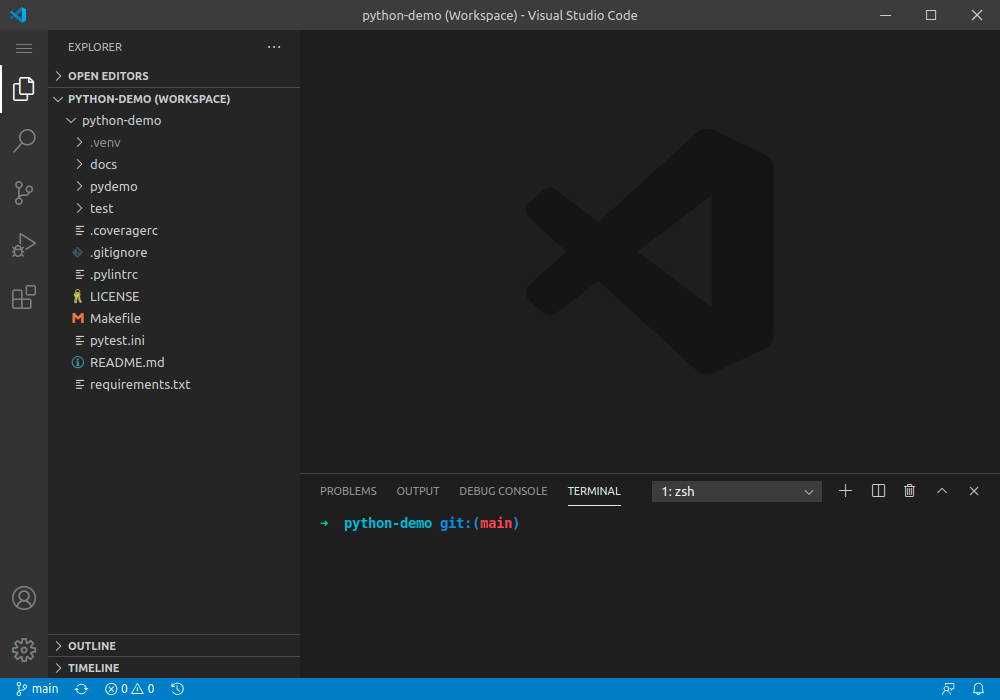
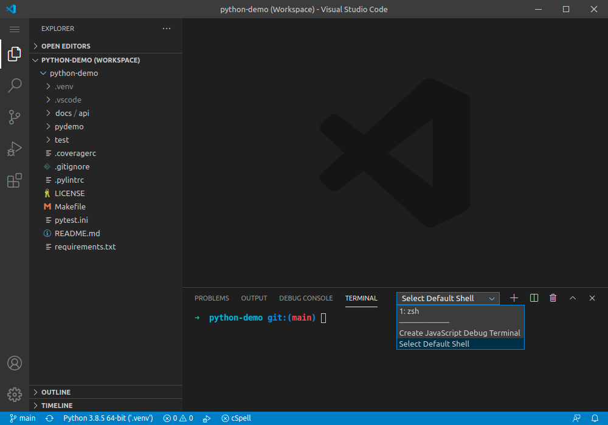
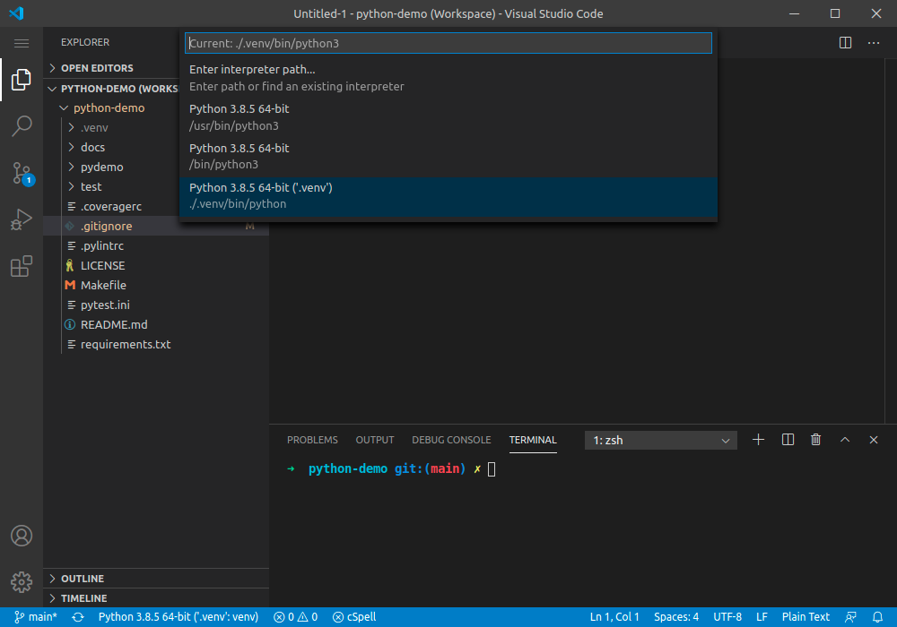

# VSCode notes

## Recommended extensions



## Workspaces

#### What are workspaces?

A VSCode workspace is just a file that includes:

* The folder(s) of your project
* Tools used (e.g. the path of the Python environment)
* Some settings (e.g. the type of terminal to be used)

This files follow JSON specification, but accept comments. For comments, uou can use single line (`//`) as well as block comments (`/* */`) as in JavaScript. The file extension is not `.json` but `.code-workspace`.

Working with workspaces will allow you to easily switch from one project to another one, or to start VSCode with a given setup.

#### Step 1: Create

Go to:

```bash
# Just in case, close the active workspace
Menu > File > Close Workspace

# Create the new one
Menu > File > Save Workspace As...
```

The extension of the workspace must be `.code-workspace`.

You will see that the VSCode bottom line is now blue (instead of purple) and the name of thew workspace appears in the top bar:



#### Step 2: Add code folders

Once Go to:

```bash
Menu > File 
```

## Select default shell

Open a new terminal:

```bash
Menu > Terminal > New Terminal
```

In the terminal pane, click the down arrow and then **Select Default Shell**.



## VSCode and Python

#### Select the interpreter

Before running any script or debugging, you have to select the interpreter to be used.

Press **F1** and type "Python Select Interpreter". Then select the workspace and choose the interpreter.



#### Execute a module


#### Debug a module